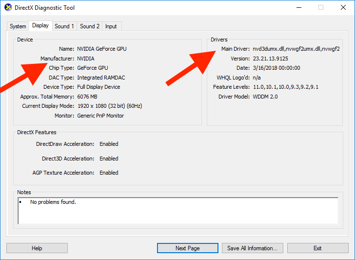
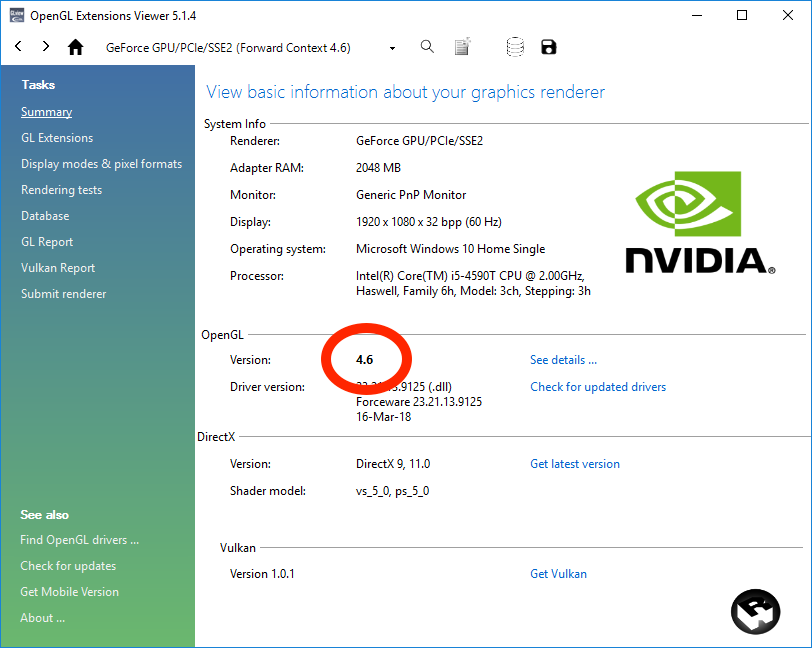
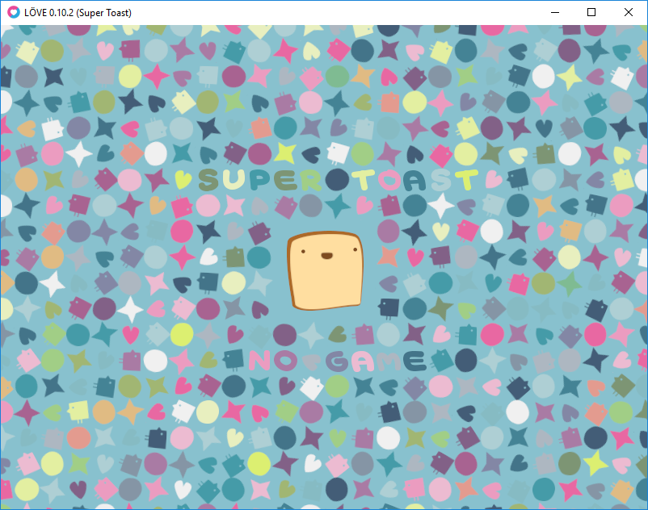

# Troubleshooting for Kingdom Rush Frontiers / Kingdom Rush Origins

## Windows

### Requirements checklist
- OpenGL 3.0 or later.
- 512 MB of video RAM.
- Display set in 32-bit color depth. 
- Windows 7 or later. 

### Checking which version of OpenGL your system supports

1. Check for basic drivers install
  - Click Start -> Run in the taskbar
  - Type 'dxdiag', and the dxdiag application should show up (if you have DirectX installed)
  - Click the dxdiag application to run it
  - Go to the Display tab, where all video card statistics will be shown. 
  - If the manufacturer is 'blank' and the driver name is 'VGA.DLL', there is no driver installed in your system, and you need to go to the manufacturer website to download and install one.

2. Check for OpenGL support
- WARNING: this require installing a third party software. Do it at your own risk.
- download, install and run [OpenGL Extensions Viewer](http://realtech-vr.com/admin/glview).
- the supported OpenGL version appears in the Summary page, in black bold font.
- you can also check for updated drivers from the same app (in most cases)

If the version shown is lower than 3.0 you should check for updated drivers from your video card manufacturer. 
Otherwise the game might not launch, or launch and crash after a few screens. 

### Correct OpenGL drivers but game still does not launch or crashes
If the game is still not launching you can download the game engine used for KRF/KRO from here: 
https://bitbucket.org/rude/love/downloads/love-0.10.2-win32.zip

- WARNING: this require installing a third party software. Do it at your own risk.
- Download and unzip the file
- Run love.exe
- You should see an image like the one below. 
- If it does not launch or nothing appears it means that your system will not run the game.
  - A possible solution is to install updated drivers from your manufacturer.

## macOS

### Requirements checklist
- OpenGL 3.0 or later.
- 512 MB of video RAM.
- Display set in 32-bit color depth. 
- macOS 10.8 or later

### Checking which version of OpenGL your system supports
- WARNING: this require installing a third party software. Do it at your own risk.
- download OpenGL Extensions Viewer from the Mac App Store or from [here](http://realtech-vr.com/admin/glview).
- the supported OpenGL version appears in the Summary page, in black bold font.
